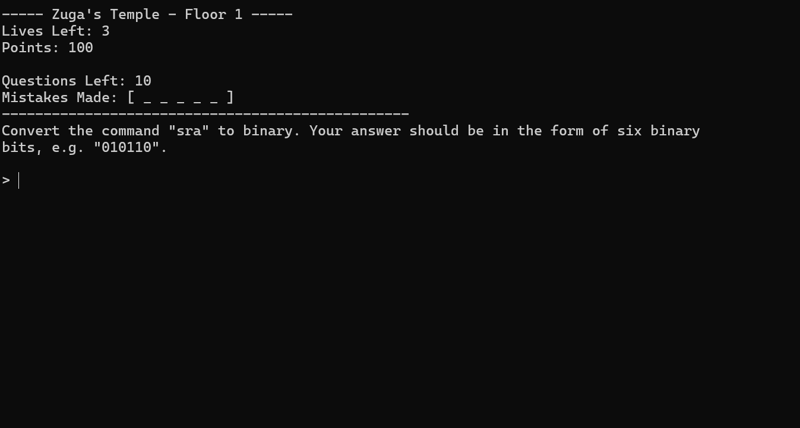

<p align="center">
    
</p>

# Zuma but Binary
## Overview
Zuma but Binary is a simple Python program I made to help with learning the binary representation of various MIPS commands, as well as help with memorising how to convert between them. The program itself was made in a couple of days, and is fully console-based.

## Features
- A game-like approach that makes progress much more visible, as well as opens the doors for challenging yourself.
- Fourteen different stages that each test a differnet part of converting between MIPS and Binary, escalating in difficulty and the number of questions.
- A practice mode where you can practice with the specific questions you want, as well as the specific type of questions that you need practice with.
- A fully console-based system and area for the game to run in.

## Requirements
All you need is Python 3.12 or any higher version in order to run the game.

## Installation
Clone this git repository, or simply download the game as a zip file. Then, navigate to its folder in a command prompt, and type ```python main.py```.

## Usage
The program itself is easil customizable, meaning you can add in or remove commands that you want to learn. You can also change the questions and their answers, or even add your own questions.

The data for every command can be found in the ```data.py``` file. If you want to add or remove a command, make srue that you add it to every relevant dictionary.

For adding new levels to the campaign, simply add a new entry to the rounds list in ```GameInstance.handleGame```, as well as in ```GameInstance.play```.

For adding new question difficulties, add them to ```generateQuestion```.

## Contributions
Contributions to the project are always welcome, such as adding other commands, new question types, new temples and question difficulties, or more gamemodes.

## License
Zuma but Binary is released under the [MIT License](LICENSE.md).